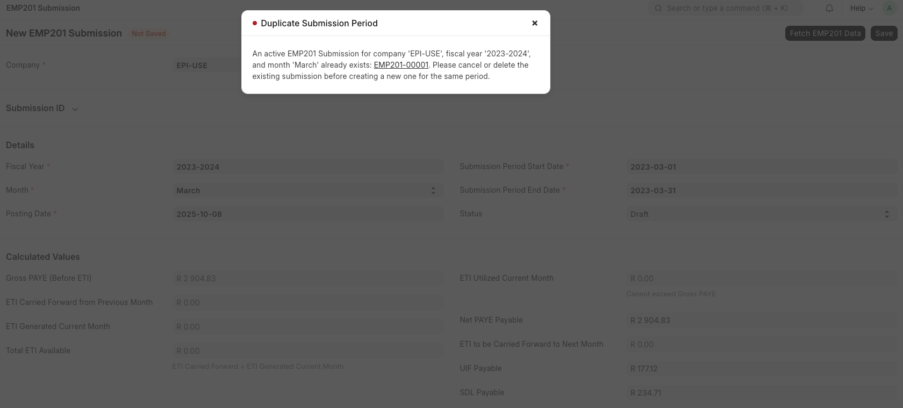
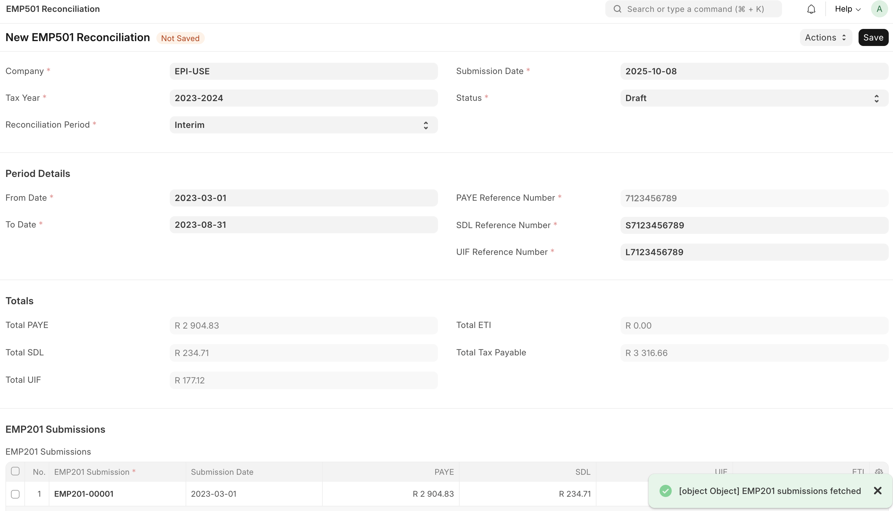

# South African Kartoza Development by Cohenix

## Overview
This document serves to reflect additions and changes done by Cohenix to the public Kartoza module.

#### For the following areas:

1. IRP5 Certificates
2. SARS Codes
3. EMP201
4. EMP501
5. ETI related
6. Install/ Uninstall script

## 1. IRP5 Certificates

- Logic: /kartoza/kartoza/kartoza/doctype/irp5_certificate.py
- docTypes & fields: 
    - IRP5 Certificate: Certificate Number, Tax Year, Reconciliation Period (Interim/ Final), From Date, To Date, Company, Department, Employee, Generation Mode (Individual/ Bulk), Status
    - child docTypes:
        - IRP5 Income Detail: Income Code, Description, Amount, Tax Year, Period
        - IRP5 Deduction Detail: Income Code, Description, Amount, Tax Year, Period
        - IRP5 Company Contribution Detail: Income Code, Description, Amount, Tax Year, Period
    - Tax Calculation: PAYE, UIF, SDL, ETI, Total Tax Payable

## 2. SARS Codes

- Path: /kartoza/kartoza/kartoza/doctype/irp5_certificate/irp5_certificate.py

## 3. EMP201: Salary Slip data

- Logic: /kartoza/kartoza/kartoza/doctype/emp201_submission/emp201_submission.py
- docTypes & fields: 
    - EMP201 Submission: 
        - Company
        - Submission ID: Full Submission ID
        - Details: Fiscal Year, Month, Posting Date, Submission Period Start Date (auto populates), Submission Period End Date (auto populates), Status
        - Calculated Values: Gross PAYE (Before ETI), ETI Carried Forward from Previous Month, ETI Generated Current Month, Total ETI Available, ETI Utilized Current Month, Net PAYE Payable, ETI to be Carried Forward to Next Month, UIF Payable, SDL Payable
- Custom Fields paths: 
    - kartoza/kartoza/kartoza/custom/
    - kartoza/kartoza/fixtures/custom_field.json
- "Fetch EMP201 Data" button: Retrieves Salary Slip data and displays in added Calculated Values section
- Validation: Prevent duplicate EMP201s being added

- Reports: "Report: EMP201 Submission"; "EMP201 Report"

## 4. EMP501: Fetches Submitted EMP201 data

- Logic: /kartoza/kartoza/kartoza/doctype/emp501_reconciliation.py
- docTypes & fields: 
    - EMP501 Reconciliation: 
        - Company, Tax Year, Reconciliation Period, Submission Date, Status
        Period Details: From Date (auto), To Date (auto), PAYE Reference Number (auto from Company), SDL Reference Number (auto from Company), UIF Reference Number (auto from Company)
        - Totals (auto): Total PAYE, Total SDL, Total UIF, Total ETI, Total Tax Payable
        - EMP201 Submissions: child table (auto)
        - IRP5 Certificates: child table (auto)
        - Amendment Details: Amended, Previous Submission
        - Notes: 
        - SARS Submission Details: SARS Submission Status, SARS Submission Date, SARS Submission Reference, SARS Response
        - Export Files: child table

- Custom Fields paths: 
    - kartoza/kartoza/kartoza/custom/
    - kartoza/kartoza/fixtures/custom_field.json
- Button "Fetch EMP201 Data": Retrieves Salary Slip data and displays in added Calculated Values section
- Validations: PAYE, UIF, SDL Reference Numbers required - populated under Company
- Report: "Report: EMP501 Reconciliation"

## 5. ETI related

Doctype: Payroll Settings
Flag: Disable ETI Calculation [default]
In order to remove errors and validations related to ETI when a company is not entitled to it or does not want to apply the functionality, hence it should not be seen (requires further development)

## 6. Uninstall

- uninstall.py: cohenix-bench/apps/kartoza/kartoza/uninstall.py
    Specify fields and doctypes to be deleted within this file for uninstall.
- install.py: cohenix-bench/apps/kartoza/kartoza/install.py
